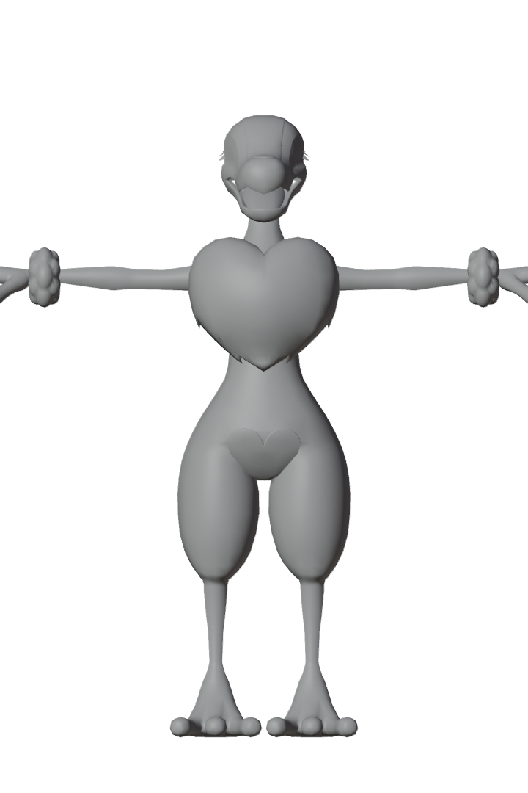
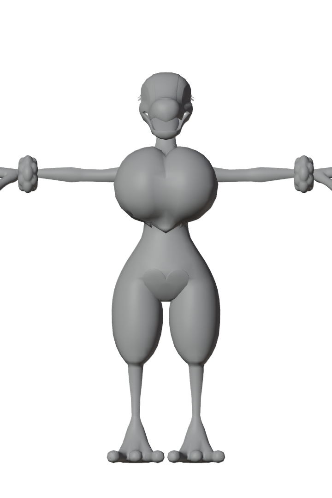

# Big Tiddy Palworld

Body-Mod für 20+ weibliche Pals in **Palworld** — mit stufenlosem
**Größen-Slider im Spiel** (F6/F7). Clientseitig, jederzeit rückstandslos
deinstallierbar.

*Body mod for 20+ female Pals in Palworld with an in-game size slider —
[English quick install below](#english-quick-install).*

| Vorher | Nachher (Slider 1.0) |
|---|---|
|  |  |

## Features

- **28 Meshes / 22 Pal-Arten** inkl. Varianten: Bellanoir (+Libero), Bristla,
  Carnibora, Dazzi (+Noct), Elizabee, Flaracle, Flopie, Gloopie (+Primo),
  Icelyn, Katress (+Ignis), Lapure, Lovander, Lullu, Lunaris, Lyleen (+Noct),
  Nitemary (+Botan), Nyafia, Petallia (+Ignis), Prunelia, Sekhmet, Selyne,
  Splatterina
- **Größen-Slider im Spiel** (0.0–1.5) über ein UE4SS-Lua-Mod:
  Die Vergrößerung steckt als *Morph Target* im Mesh — bei Wert 0 sieht alles
  aus wie im Original-Spiel
- **Natürliche Form**: Zwei-Lobe-Modell mit Dekolleté und Teardrop-Profil
  statt platter Skalierung
- **Original-Animationen, -Texturen und -Materialien** bleiben vollständig
  erhalten (Referenz-Skelett wird beim Bauen bit-genau gegen das Original
  verifiziert)
- Rein clientseitig — andere Spieler auf Servern sehen nichts davon

**Nicht enthalten:** Jelliette — der Quallen-Körperbau verträgt den
Morph (noch) nicht.

## Installation (Deutsch)

Siehe **[INSTALLATION.md](INSTALLATION.md)** für die ausführliche Anleitung
mit UE4SS-Einrichtung. Kurzfassung:

1. `zzz_BustMod_P.pak` (aus den [Releases](../../releases)) nach
   `Palworld\Pal\Content\Paks\~mods\` kopieren (Ordner ggf. anlegen)
2. Für den Slider: [UE4SS](https://docs.ue4ss.com/) installieren und den
   Ordner `BustSliderMod` aus dem Release nach
   `Palworld\Pal\Binaries\Win64\ue4ss\Mods\` kopieren, dann in der
   `Mods\mods.txt` die Zeile `BustSliderMod : 1` ergänzen
3. Spiel starten — **F7** größer, **F6** kleiner, Wert wird gespeichert

Deinstallation: die `.pak` aus `~mods` löschen, fertig.

## Selbst bauen (Pipeline)

Das Repo enthält die komplette, automatisierte Build-Pipeline — es werden
**keine Spiel-Assets** mitgeliefert, alles wird lokal aus der eigenen
Palworld-Installation extrahiert:

```
PalExporter (CUE4Parse)      Blender 5.x headless           UE 5.1 headless
.psk + manifest.json    ->   bust_morph.py                ->  ue_import.py     -> cook_and_pack.ps1
(UE-Koordinaten, cm)         (Morph als Shape Key             (Import an           (Pak bauen,
                              "BustSize", QA-Renders)          Original-Pfade)      verifizieren,
                                                                                    installieren)
```

Voraussetzungen: Palworld (Steam), [Blender 5.x](https://www.blender.org/)
mit [io_scene_psk_psa](https://github.com/DarklightGames/io_scene_psk_psa),
[Unreal Engine 5.1](https://www.unrealengine.com/), .NET-10-SDK, eine zur
Spielversion passende `Mappings.usmap`
(z. B. aus [PalworldModding/UsefulFiles](https://github.com/PalworldModding/UsefulFiles)).

```powershell
# 1. Meshes + Metadaten aus dem Spiel exportieren
dotnet run --project src/PalExporter -c Release -- `
    --paks "<Palworld>\Pal\Content\Paks" --usmap tools\mappings\Palworld.usmap `
    --targets data\target_pals.txt --out export

# 2. Alles morphen, importieren, cooken, packen, verifizieren, installieren
.\scripts\run_batch.ps1 -Factor 2.5 -Install
```

Pfade (Engine, Spiel, Blender) stehen am Kopf von `scripts/cook_and_pack.ps1`
und `scripts/run_batch.ps1`.

## Technische Details

- Der Export läuft über **ActorX (.psk)** statt glTF — glTF spiegelt das
  Koordinatensystem und invertiert damit alle Bone-Rotationen (kaputte
  Animationen). Die Lektion steht ausführlich in der Git-Historie.
- Ins Pak kommen **nur die SkeletalMesh-Assets**; Skeleton, Materialien und
  PhysicsAsset bleiben Platzhalter und lösen zur Laufzeit auf die Originale
  des Spiels auf.
- `PalExporter --verify-pak` vergleicht nach jedem Build das Referenz-Skelett
  jedes Meshes Knochen für Knochen (Namen, Hierarchie, Transforms) mit dem
  Original — erst bei null Abweichungen wird installiert.

## English Quick Install

1. Download `zzz_BustMod_P.pak` from [Releases](../../releases) and drop it
   into `Palworld\Pal\Content\Paks\~mods\` (create the folder if needed).
2. Optional size slider: install [UE4SS](https://docs.ue4ss.com/), copy the
   `BustSliderMod` folder into `Palworld\Pal\Binaries\Win64\ue4ss\Mods\`,
   add `BustSliderMod : 1` to `Mods\mods.txt`.
3. In game: **F7** = bigger, **F6** = smaller (0.0–1.5, persisted).
   At 0.0 everything looks vanilla. Uninstall = delete the pak. Client-side only.

## Disclaimer

Dieses Repo enthält keine Assets von Pocketpair. Nutzung auf eigene Gefahr;
nicht für den Einsatz auf Servern gedacht, deren Regeln Mods untersagen.
